## Flowchart

### 1. A node (default)

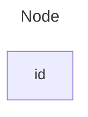

### 2. A node with text

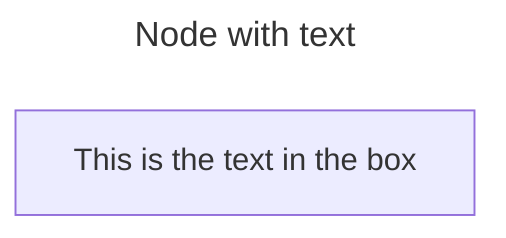

### 3. Unicode text

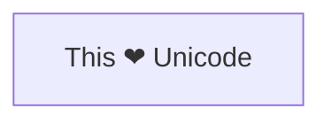

### 4. Markdown formatting

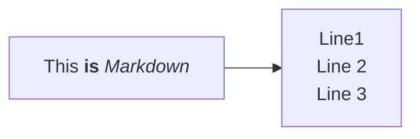

### 5. Direction

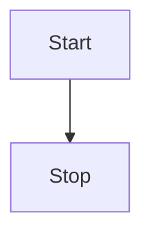


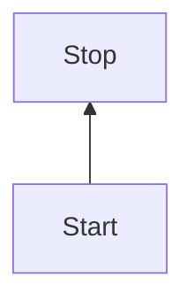

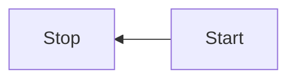

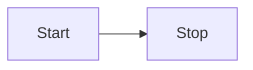

### 6. A node with round edges

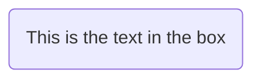

### 7. A stadium-shaped node

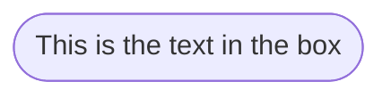

### 8. A node in a subroutine shape

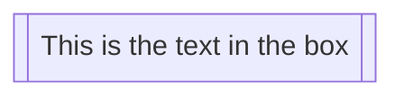

### 9. A node in a cylindrical shape

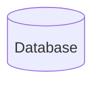

### 10. A node in the form of a circle

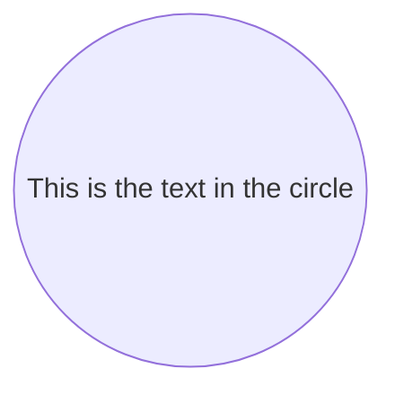

### 11. A node in an asymmetric shape

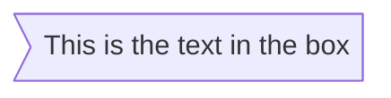

### 12. A node (rhombus)

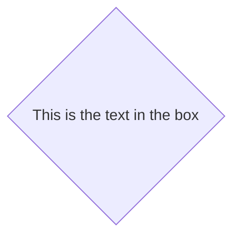

### 13. A hexagon node

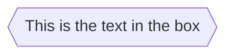

### 14. Parallelogram

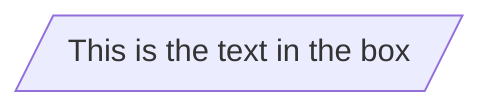

### 15. Parallelogram alt

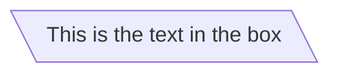

### 16. Trapezoid

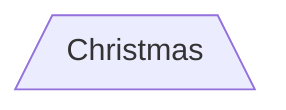

### 17. Trapezoid alt

```mermaid
flowchart TD
  B[\Go shopping/]
```

### 18. Double circle

```mermaid
flowchart TD
  id1(((This is the text in the circle)))
```

### 19. Example Flowchart with New Shapes

```mermaid
flowchart RL
  A@{ shape: manual-file, label: "File Handling"}
  B@{ shape: manual-input, label: "User Input"}
  C@{ shape: docs, label: "Multiple Documents"}
  D@{ shape: procs, label: "Process Automation"}
  E@{ shape: paper-tape, label: "Paper Records"}
```

### 20. Process

```mermaid
flowchart TD
  A@{ shape: rect, label: "This is a process" }
```

### 21. Event

```mermaid
flowchart TD
    A@{ shape: rounded, label: "This is an event" }
```

### 22. Terminal Point (Stadium)

```mermaid
flowchart TD
  A@{ shape: stadium, label: "Terminal point" }
```

### 23. Subprocess

```mermaid
flowchart TD
  A@{ shape: subproc, label: "This is a subprocess" }
```

### 24. Database (Cylinder)

```mermaid
flowchart TD
  A@{ shape: cyl, label: "Database" }
```

### 25. Start (Circle)

```mermaid
flowchart TD
  A@{ shape: circle, label: "Start" }
```

### 26. Odd

```mermaid
flowchart TD
  A@{ shape: odd, label: "Odd shape" }
```

### 27. Decision (Diamond)

```mermaid
flowchart TD
  A@{ shape: diamond, label: "Decision" }
```

### 28. Prepare Conditional (Hexagon)

```mermaid
flowchart TD
  A@{ shape: hex, label: "Prepare conditional" }
```

### 29. Data Input/Output (Lean Right)

```mermaid
flowchart TD
  A@{ shape: lean-r, label: "Input/Output" }
```

### 30. Data Input/Output (Lean Left)

```mermaid
flowchart TD
  A@{ shape: lean-l, label: "Output/Input" }
```

### 31. Priority Action (Trapezoid Base Bottom)

```mermaid
flowchart TD
  A@{ shape: trap-b, label: "Priority action" }
```

### 32. Manual Operation (Trapezoid Base Top)

```mermaid
flowchart TD
  A@{ shape: trap-t, label: "Manual operation" }
```

### 33. Manual Operation (Trapezoid Base Top)

```mermaid
flowchart TD
  A@{ shape: dbl-circ, label: "Stop" }
```

### 34. Text Block

```mermaid
flowchart TD
  A@{ shape: text, label: "This is a text block" }
```

### 35. Card (Notched Rectangle)

```mermaid
flowchart TD
  A@{ shape: notch-rect, label: "Card" }
```

### 36. Lined/Shaded Process

```mermaid
flowchart TD
  A@{ shape: lin-rect, label: "Lined process" }
```

### 37. Start (Small Circle)

```mermaid
flowchart TD
  A@{ shape: sm-circ, label: "Small start" }
```

### 38. Stop (Framed Circle)

```mermaid
flowchart TD
  A@{ shape: framed-circle, label: "Stop" }
```

### 39. Fork/Join (Long Rectangle)

```mermaid
flowchart TD
  A@{ shape: fork, label: "Fork or Join" }
```

### 40. Collate (Hourglass)

```mermaid
flowchart TD
  A@{ shape: hourglass, label: "Collate" }
```

### 41. Comment (Curly Brace)

```mermaid
flowchart TD
  A@{ shape: comment, label: "Comment" }
```

### 42. Comment Right (Curly Brace Right)

```mermaid
flowchart TD
  A@{ shape: brace-r, label: "Comment" }
```

### 43. Comment with braces on both sides

```mermaid
flowchart TD
  A@{ shape: braces, label: "Comment" }
```

### 44. Com Link (Lightning Bolt)

```mermaid
flowchart TD
  A@{ shape: bolt, label: "Communication link" }
```

### 45. Document

```mermaid
flowchart TD
  A@{ shape: doc, label: "Document" }
```

### 46. Delay (Half-Rounded Rectangle)

```mermaid
flowchart TD
  A@{ shape: delay, label: "Delay" }
```

### 47. Direct Access Storage (Horizontal Cylinder)

```mermaid
flowchart TD
  A@{ shape: das, label: "Direct access storage" }
```

### 48. Disk Storage (Lined Cylinder)

```mermaid
flowchart TD
  A@{ shape: lin-cyl, label: "Disk storage" }
```

### 49. Display (Curved Trapezoid)

```mermaid
flowchart TD
  A@{ shape: curv-trap, label: "Display" }
```

### 50. Divided Process (Divided Rectangle)

```mermaid
flowchart TD
  A@{ shape: div-rect, label: "Divided process" }
```

### 51. Extract (Small Triangle)

```mermaid
flowchart TD
  A@{ shape: tri, label: "Extract" }
```

### 52. Internal Storage (Window Pane)

```mermaid
flowchart TD
  A@{ shape: win-pane, label: "Internal storage" }
```

### 53. Junction (Filled Circle)

```mermaid
flowchart TD
  A@{ shape: f-circ, label: "Junction" }
```

### 54. Lined Document

```mermaid
flowchart TD
  A@{ shape: lin-doc, label: "Lined document" }
```

### 55. Loop Limit (Notched Pentagon)

```mermaid
flowchart TD
  A@{ shape: notch-pent, label: "Loop limit" }
```

### 56. Manual File (Flipped Triangle)

```mermaid
flowchart TD
  A@{ shape: flip-tri, label: "Manual file" }
```

### 57. Manual Input (Sloped Rectangle) 

```mermaid
flowchart TD
  A@{ shape: sl-rect, label: "Manual input" }
```

### 58. Multi-Document (Stacked Document)

```mermaid
flowchart TD
  A@{ shape: docs, label: "Multiple documents" }
```

### 59. Multi-Document (Stacked Document)

```mermaid
flowchart TD
  A@{ shape: processes, label: "Multiple processes" }
```

### 60. Paper Tape (Flag)

```mermaid
flowchart TD
  A@{ shape: flag, label: "Paper tape" }
```

### 61. Stored Data (Bow Tie Rectangle)

```mermaid
flowchart TD
  A@{ shape: bow-rect, label: "Stored data" }
```

### 62. Summary (Crossed Circle)

```mermaid
flowchart TD
  A@{ shape: cross-circ, label: "Summary" }
```

### 63. Tagged Document 

```mermaid
flowchart TD
  A@{ shape: tag-doc, label: "Tagged document" }
```

### 64. Tagged Process (Tagged Rectangle)

```mermaid
flowchart TD
  A@{ shape: tag-rect, label: "Tagged process" }
```

### 65. Icon Shape

```mermaid
flowchart TD
  A@{ icon: "fa:user", form: "square", label: "User Icon", pos: "t", h: 60 }
```

### 66. Image Shape

```mermaid
flowchart TD
  A@{ img: "https://placehold.co/60x60", label: "Image Label", pos: "t", w: 60, h: 60, constraint: "off" }
```

```mermaid
flowchart TD
  %% My image with a constrained aspect ratio
  A@{ img: "https://mermaid.js.org/favicon.svg", label: "My example image label", pos: "t", h: 60, constraint: "on" }
```

### 67. A link with arrow head

```mermaid
flowchart LR
  A-->B
```

### 68. An open link

```mermaid
flowchart LR
  A --- B
```

### 69. Text on links

```mermaid
flowchart LR
  A-- This is the text! ---B
```

```mermaid
flowchart LR
  A---|This is the text|B
```

### 70. A link with arrow head and text

```mermaid
flowchart LR
  A-->|text|B
```

```mermaid
flowchart LR
  A-- text -->B
```

### 71. Dotted link

```mermaid
flowchart LR
  A-.->B;
```

### 72. Dotted link with text

```mermaid
flowchart LR
  A-. text .-> B
```

### 73. Thick link

```mermaid
flowchart LR
  A ==> B
```

### 74. Thick link with text

```mermaid
flowchart LR
  A == text ==> B
```

### 75. An invisible link

```mermaid
flowchart LR
  A ~~~ B
```

### 76. Chaining of links

```mermaid
flowchart LR
   A -- text --> B -- text2 --> C
```

```mermaid
flowchart LR
  a --> b & c--> d
```

```mermaid
flowchart TB
  A & B--> C & D
```

```mermaid
flowchart TB
  A --> C
  A --> D
  B --> C
  B --> D
```

### 77. Attaching an ID to Edges

```mermaid
flowchart LR
  A e1@--> B
```

### 78. Turning an Animation On

```mermaid
flowchart LR
  A e1@==> B
  e1@{ animate: true }
```

### 79. Selecting Type of Animation

```mermaid
flowchart LR
  A e1@--> B
  e1@{ animation: fast }
```

### 80. Using classDef Statements for Animations

```mermaid
flowchart LR
  A e1@--> B
  classDef animate stroke-dasharray: 9,5,stroke-dashoffset: 900,animation: dash 25s linear infinite;
  class e1 animate
```

### 81. Circle edge example

```mermaid
flowchart LR
  A --o B
```

### 82. Circle edge example

```mermaid
flowchart LR
  A --x B
```

### 83. Multi directional arrows

```mermaid
flowchart LR
  A o--o B
  B <--> C
  C x--x D
```

### 84. Minimum length of a link

```mermaid
flowchart TD
  A[Start] --> B{Is it?}
  B -->|Yes| C[OK]
  C --> D[Rethink]
  D --> B
  B ---->|No| E[End]
```

```mermaid
flowchart TD
  A[Start] --> B{Is it?}
  B -- Yes --> C[OK]
  C --> D[Rethink]
  D --> B
  B -- No ----> E[End]
```

### 85. Special characters that break syntax

```mermaid
flowchart LR
  id1["This is the (text) in the box"]
```

### 86. Entity codes to escape characters

```mermaid
flowchart LR
  A["A double quote:#quot;"] --> B["A dec char:#9829;"]
```

> Made with '\u{2665}' (♥) by Jesús Domínguez [@bluefeatherdev](https://github.com/bluefeatherdev)
